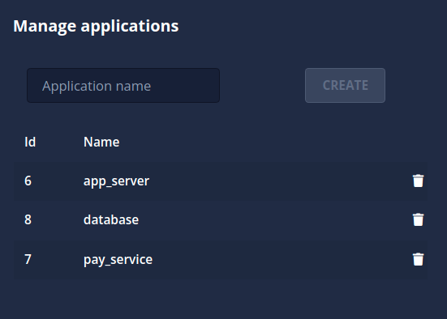

# Manage applications

> [!TIP]
> The manage application screen can be found in the [Integration page](/logsight_ui/integration_page.md)

In this section the user can learn how to create and delete `applications`.

An `application` in logsight.ai is an independent source of log data. An example of an application may be a payment service, database, or authentication service (a single app).

By writing `Application name` and creating the app in the background, several services are enabled that are ready to provide insights and analysis for the shipped logs.

