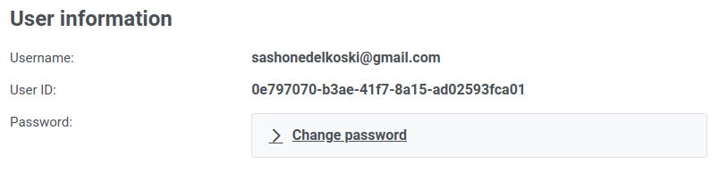

# User info

> [!TIP]
> The user info screen can be found in the `in the User Settings page`.

The user info section contains the `Username` (email) and the `User ID` of the user. The `User ID` is important for several operations in logsight (e.g., creating applications, sending logs, etc.). It is used as user identifier inside the platform.

  

