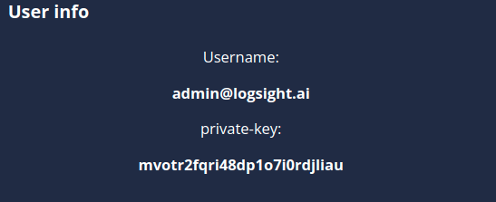

# User info

> [!TIP]
> The user info screen can be found in the [Integration page](/logsight_ui/integration_page.md)
> and also in the [View account](/administration/view_account.md)

The user info section contains the `Username` (email) and the `private-key` of the user. The `private-key` is important when the user sends data to logsight, it is used as user identifier inside the platform.

