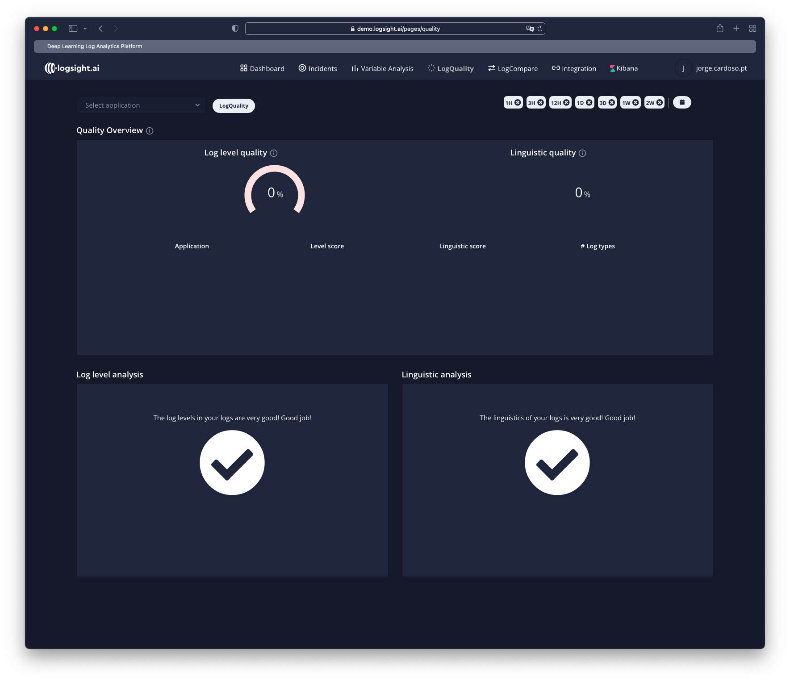

# Analyze log quality

The quality of a analysis result heavily depends on the input. Therefore, event
logs should be treated as first-class citizens in the information systems supporting the processes to be analyzed. Unfortunately, event logs are often merely
a “by-product” used for debugging or profiling.
There are several criteria to judge the quality of event data. Events should be
trustworthy, i.e., it should be safe to assume that the recorded events actually
happened and that the attributes of events are correct. Event logs should be
complete, i.e., given a particular scope, no events may be missing. Any recorded
event should have well-defined semantics.

**LogQuality** provides semantic and linguistic analysis of the log data and provides recommendations to improve the quality of the logs.

Simple usage would be:
1. `Select application`
2. `Choose time interval`
3. `Click on LogQuality`
4. `Check the results`