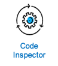

# Code Inspector

`logsight.ai` supports the semantic and linguistic analysis of code and log data,
and provides recommendations to improve the quality of the logs.

## Processing Workflow

1. `Shipping code/logs`. You set up git access or a log collector to gather logs across your applications.
We access your code or you ship the logs to our centralized logging platform.
3. `AI-processing`. We analyze your code/logs to identify low quality log statements using various AI-models. 
4. `Customer AI model`. We can also use specialised and customized AI-models to model customers' IT systems. 
5. `Quality metrics`. Our AI-models quantify your code/log quality.
6. `Notification`. We send you a notification when the quality is low according to best practices.

> [!WARNING] Update image

## Intelligent NLP

### Level analysis
To come ...

### Linguistic analysis
To come ...

### Intelligent recommendation
To come ...

> [!NOTE]
> Quantitative code quality metrics provide a guide for better and faster CI/CD