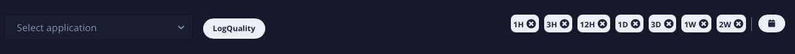
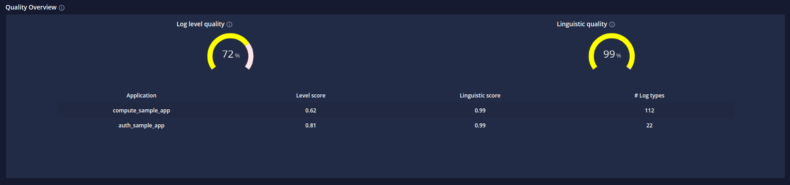
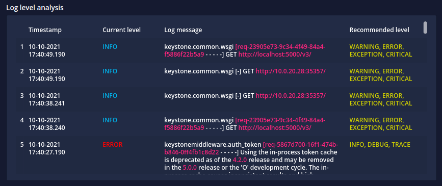
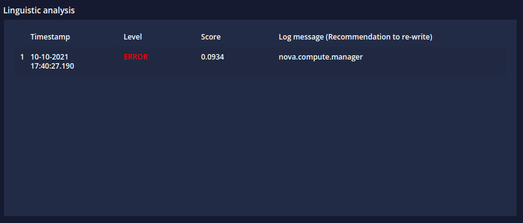

# Code Inspector Dashboard

> The code inspector dashboard provides a bird's-eye view of code and log quality analysis

 

 

`Application name`, `Time frame` and `LogQuality` Select the application to analyze over a specific time frame.
Click on the LogQuality button to start the computation.

`Quality overview`

`Log level analysis`

`Log linguistic analysis`

