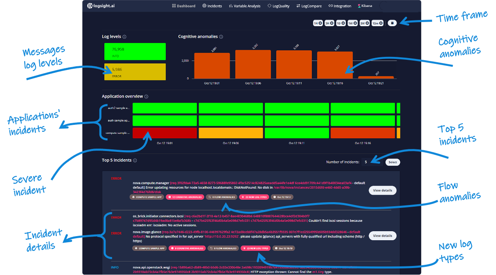

# Try out logsight.ai locally

>You've heard about how `logsight.ai` can help you write cleaner and safer logs, verify deployments, and detect incidents in production, and now you're ready to try it out for yourself. This guide shows you how to install a local instance of logsight.ai and analyze the logs of a service.

Once you're ready to set up a production instance <a href="mailto:support@logsight.ai">contact us</a> for full support and guidance.

## Installing a local instance of logsight.ai

The easiest way to evaluate logsight.ai is by running a Docker container using 

`how to install`

Once your instance is up and running. Go to <a href="http://localhost:8080" target="_blank"> http://localhost:8080 </a>, register an account and log in.

## Analyzing your project

Now that you are logged in to your local `logsight.ai` instance let's analyze the logs of a service. A quick way to explore the platform is:
1. Load data
   1. Go to <a href="http://localhost:4200/pages/sample-data">http://localhost:4200/pages/sample-data </a> and **load a sample data**, or 
   2. **Upload** your syslog file located at `/var/log/syslog` (Ubuntu) or `/var/log/system.log` (Mac)
2. In <a href="http://localhost:4200/pages/dashboard">http://localhost:4200/pages/dashboard </a> and <a href="http://localhost:4200/pages/incidents">http://localhost:4200/pages/incidents </a> you can **explore the detected incidents** and faults. (<a href="https://docs.logsight.ai/#/detect_incidents/incident_detector">Read more</a>)
3. In <a href="http://localhost:4200/pages/compare">http://localhost:4200/pages/compare </a> you can **compare/verify logs** from different deployments. (<a href="https://docs.logsight.ai/#/monitor_deployments/stage_verifier">Read more</a>)

