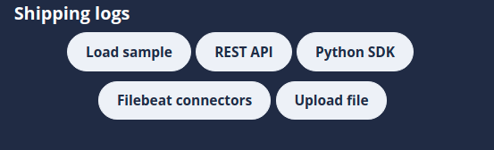

# Shipping logs

> [!TIP]
> The shipping logs options can be found in the [Integration page](/logsight_ui/integration.md)

There are 3 options to ship logs to `logsight.ai`:

+ [Beats](https://www.elastic.co/beats/) or [Logstash](https://www.elastic.co/logstash/). Filebeat simplifies the collection, parsing, and visualization of common log formats. We support 70+ 
  connectors to various systems ([Docs | Filebeat](https://docs.logsight.ai/#/send_logs/using_filebeats)).
+ [SDK for Python](https://logsight-sdk-py.readthedocs.io/en/latest/). We provide a Python-SDK that enables to send logs natively inline with the code ([Docs | Python SDK](https://docs.logsight.ai/#/send_logs/send_logs_using_the_sdk)).
+ REST API. logsight.ai exposes an API that allows to send your logs using tools such as [curl](https://curl.se/) or [wget](https://www.gnu.org/software/wget/) ([Docs | REST API](https://docs.logsight.ai/#/send_logs/send_logs_using_the_sdk)).

The SDK for Python provider the greater customization for you to integrate your platform with `Logsight.ai`. 
Beats and Logstash provide out-of-the-box connector for dozens of systems (e.g., MySQL, Apache, Github, Kafka)  

This is a simple menu section that allows reading upon key concepts and instructions on how to send data from the various sources. While we are working tirelessly to enrich the sources of data:

For a quick start, you can also use sample files or upload your own log files: 
1. `Load sample` - It is a sample data that can be loaded into the platform with a purpose of enabling the user to start exploring the platform without any effort.
2. `Upload file` - We enable fast and easy log file upload (<a href="https://docs.logsight.ai/#/shipping_logs/upload_files">Docs | File upload</a>).