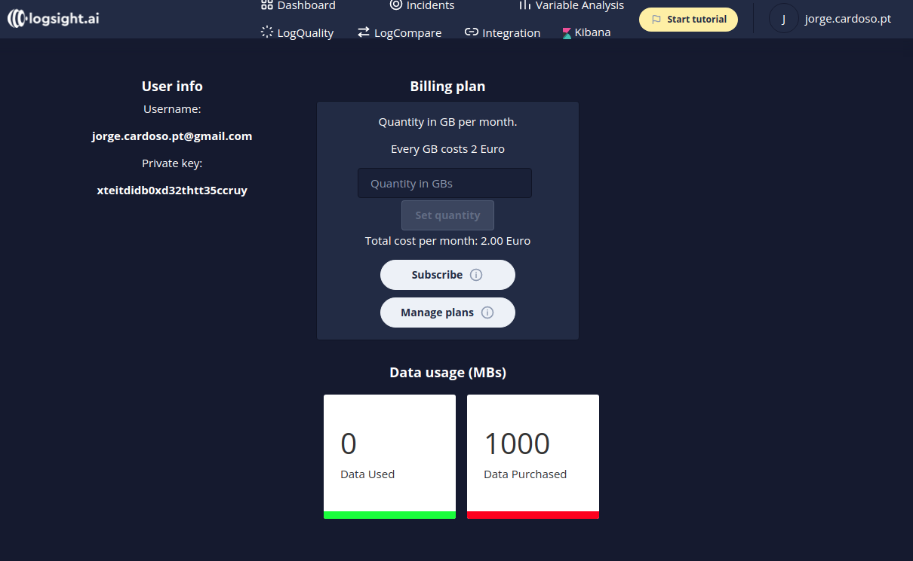
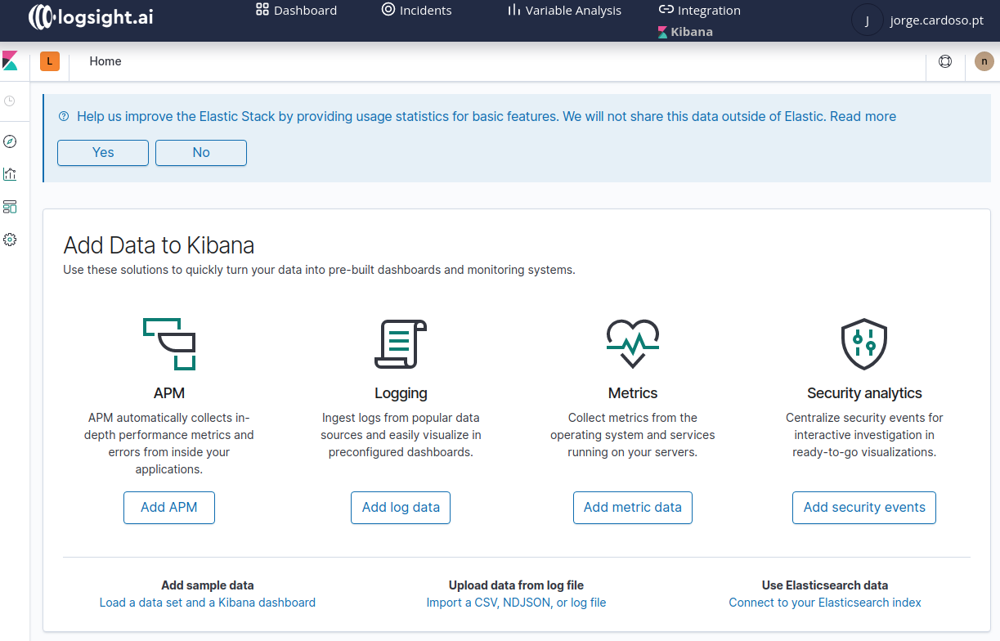

Integration
=============

The integration is the entry point for shipping logs into the logsight.ai AI platform. 

### User info

The user info section contains the `Username` (email) and the `private-key` of the user. The `private-key` is important when the user sends data to logsight, it is used as user identifier inside the platform.

### Shipping logs

This is a simple menu section that allows reading upon key concepts and instructions on how to send data from the various sources. While we are working tirelessly to enrich the sources of data, currently we support:
1. `Load sample` - It is a sample data that can be loaded into the platform with a purpose of enabling the user to start exploring the platform without any effort.
2. `REST API` - logsight.ai exposes an API that allows you to send your logs from anywhere.<a href="https://docs.logsight.ai/#/sdk_api/rest_api">Docs | REST API</a>
3. `Python SDK` - We provide a Python-SDK that enables to send logs natively inline with the code. <a href="https://docs.logsight.ai/#/sdk_api/quick_start">Docs | Python-SDK</a>
4. `Filebeat connectors` - Filebeat simplifies the collection, parsing, and visualization of common log formats. Via Filebeat, we support 70+ connectors to various systems. <a href="https://docs.logsight.ai/#/shipping_logs/filebeats">Docs | Filebeat.</a>
5. `Upload file` - We enable fast and easy log file upload. <a href="https://docs.logsight.ai/#/shipping_logs/upload_files">Docs | File upload.</a>

### Manage applications

In this section the user can create and delete `applications`.

An `application` in logsight.ai is an independent source of log data. An example of an application may be a payment service, database, or authentication service (a single app).

By writing `Application name` and creating the app in the background, several services are enabled that are ready to provide insights and analysis for the shipped logs.

## Dashboard

## Incidents

Next is our real-time incident detector which can be accessed in the
left control of the menu bar.

## Variable Analysis

## Log Quality

## Log Compare

## User Management

We've added new user management screens so it's simple to manage users.
In the coming months we\'ll add new tabs for governance.

## Kibana

