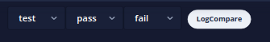
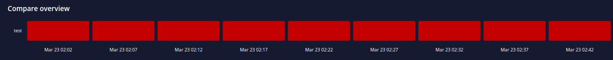
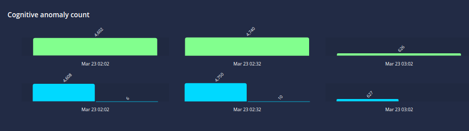
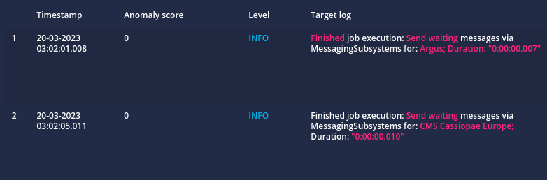
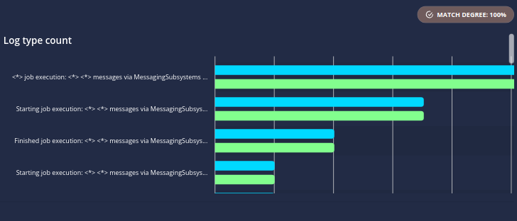

# Compare Versions

> [!TIP]
> An overview of the log compare page can be found at [Log Compare](./logsight_ui/log_compare.md)

`LogCompare` is a core logsight.ai function that is useful for comparing logs from 
different versions of deployments, comparing tests, detecting test flakiness, and other log compare tasks. 

There are several steps that you need to follow for the usage of `LogCompare`.

## Prerequisites

1. `Create application`. Use the [manage application](/administration/manage_applications)
2. `Send logs`. Use your preferred method from [shipping_logs](/send_logs/shipping_logs) to send your logs
3. `Set tags`. Use the functionality described in [set tags](/monitor_deployments/set_tags.md) to tag your logs

## Log Compare

### Set time interval and version

Use the datepicker on the right top corner.

Select the versions to compare

Click on the LogCompare button. This initiates the computation.

### Compare overview

`Compare overview`. Is a heatmap that shows the overall difference between the baseline tag (pass) and the compare tag (fail).

### Cognitive anomalies

`Cognitive anomaly count`. Shows the cognitive anomaly count for the two tags (top and bottom).

### Ratio Anomalies

`Ratio anomalies`. Shows correlated logs that "go together". For example, `Opening connection.` and `Closing connection`.  Broken ratios (high `Anomaly score`) may suggest an anomaly (deviation between the comparing logs).

### Log Groups

### Log Types

`Log type count`. Shows the count difference between the log types.

### New Log Types

`New log types`. Shows the new log types, along with the cognitive anomaly prediction. Having new log types that are labeled as Anomaly may be an indicator of a problem.