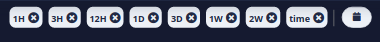
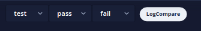
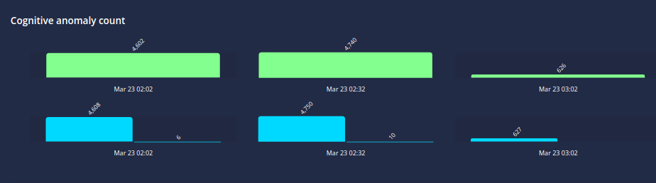
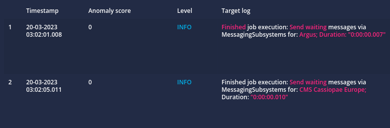
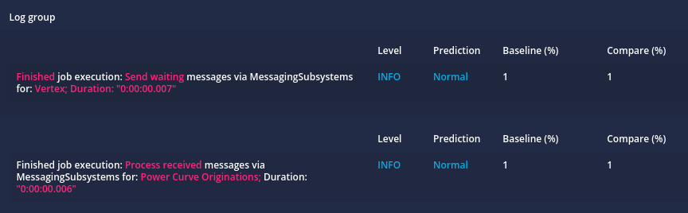
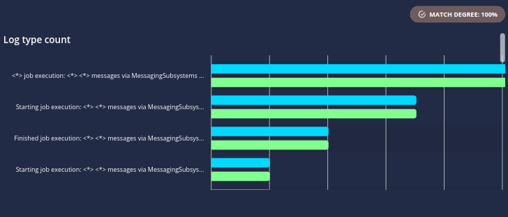
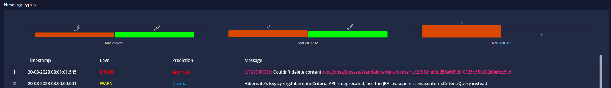

# Stage Verifier Dashboard

> The stage verifier dashboard provides a bird's-eye view of applications' deployments managed by `logsight.ai`

`Time frame` Use the datepicker on the right top corner.

`Application name`, `application version` and `LogCompare` Select the application to analyze, and the deployment versions to compare. 
The oldest version is called the baseline version.
The newest version is called the candidate version.
Click on the LogCompare button to start the computation.

 

 

`Compare overview` is a heatmap that shows the overall difference between the baseline version and the candidate version overtime.

`Cognitive anomaly count` shows the cognitive anomaly count for the baseline and candidate versions.

`Ratio anomalies` shows correlated logs that "go together".
For example, `Opening connection.` and `Closing connection`.
Broken ratios (i.e., with a anomaly score is high) may suggest an anomaly (deviation between the comparing logs).

`Log groups` is

`Log type count` shows the count difference between the log types of the baseline and candidate versions.

`New log types` shows the new log types, along with the cognitive anomaly prediction. 
Having new log types that are labeled as anomaly may be an indicator of a problem.

