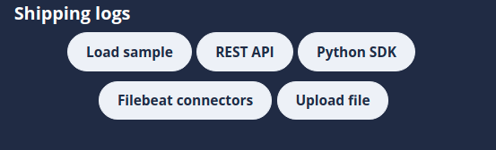

# Shipping logs

> [!TIP]
> The shipping logs options can be found in the [Integration page](/logsight_ui/integration_page.md)

This is a simple menu section that allows reading upon key concepts and instructions on how to send data from the various sources. While we are working tirelessly to enrich the sources of data, currently we support:
1. `Load sample` - It is a sample data that can be loaded into the platform with a purpose of enabling the user to start exploring the platform without any effort.
2. `REST API` - logsight.ai exposes an API that allows you to send your logs from anywhere.<a href="https://docs.logsight.ai/#/sdk_api/rest_api">Docs | REST API</a>
3. `Python SDK` - We provide a Python-SDK that enables to send logs natively inline with the code. <a href="https://docs.logsight.ai/#/sdk_api/quick_start">Docs | Python-SDK</a>
4. `Filebeat connectors` - Filebeat simplifies the collection, parsing, and visualization of common log formats. Via Filebeat, we support 70+ connectors to various systems. <a href="https://docs.logsight.ai/#/shipping_logs/filebeats">Docs | Filebeat.</a>
5. `Upload file` - We enable fast and easy log file upload. <a href="https://docs.logsight.ai/#/shipping_logs/upload_files">Docs | File upload.</a>

